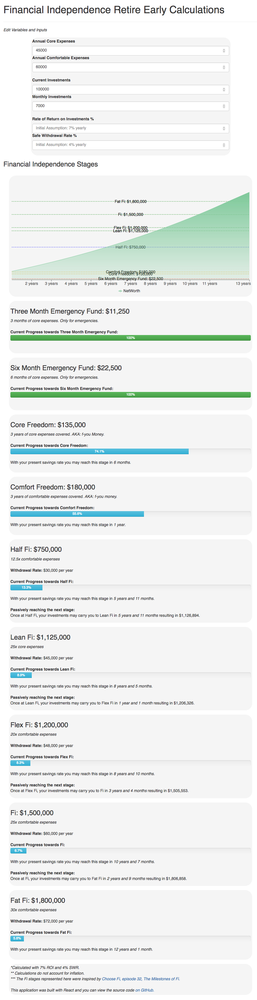

# Early Retirement Calculators
Financial Independence Retire Early Calculators built using React JS.

You can visit the live site [here](https://matgreten.dev/ficalc/index).

## Todo:
- Add option to add salary and then use percentage to override monthly savings input
- Add Descriptions of all assumptions / inputs.
- ~~Add intro modal or page to introduce FI, linking to the why of FI, pillars of FI.~~
- ~~Link to JL collins for stock investing principles.~~

## Dependencies:
- React
- React-Bootstrap
- [recharts](http://recharts.org/#/en-US/guide/installation)
    ```
    npm install recharts    
    ```

## Screenshot:


